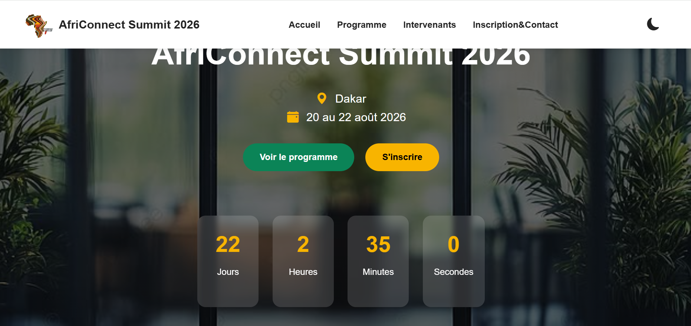

#AFRICONNECTSUMMIT
projet fil rouge -Site vitrine d'un sommet technologique et business dedie a l'Afrique.
Auteur : Khadiyatou Diallo
promotion :L1 IAGE -ISI
## Lien du site : [Africonnectsummit](https://github.com/khadiyatoud785-bit/DIALLO-KHADIYATOU-AfriConnectSummit)

## Description
Africonnect Summit 2026 est un site web presentant un sommet consacre a l'innovation,la technologie et le business en Afrique. Il regroupe les informations sur le programme, les intervenants, et permet aux visiteurs de contacter les organisateurs.

- Design Graphique
- Business
- Tech
- Data & IA
## Fonctionnalités
- Page d'accueil moderne
- Présentation du programme au sommet
- Liste des intervenants 
- Filtrage dynamique par catégorie
- Mode sombre / clair
- Formulaire de contact avec validation JavaScript
- Site responsive avec Bootstrap 5
## Technologies utilisées

- HTML5
- CSS
- Bootstrap 5
- JavaScript
- Git & GitHub
- GitHub Pages

## Capture d'écran
